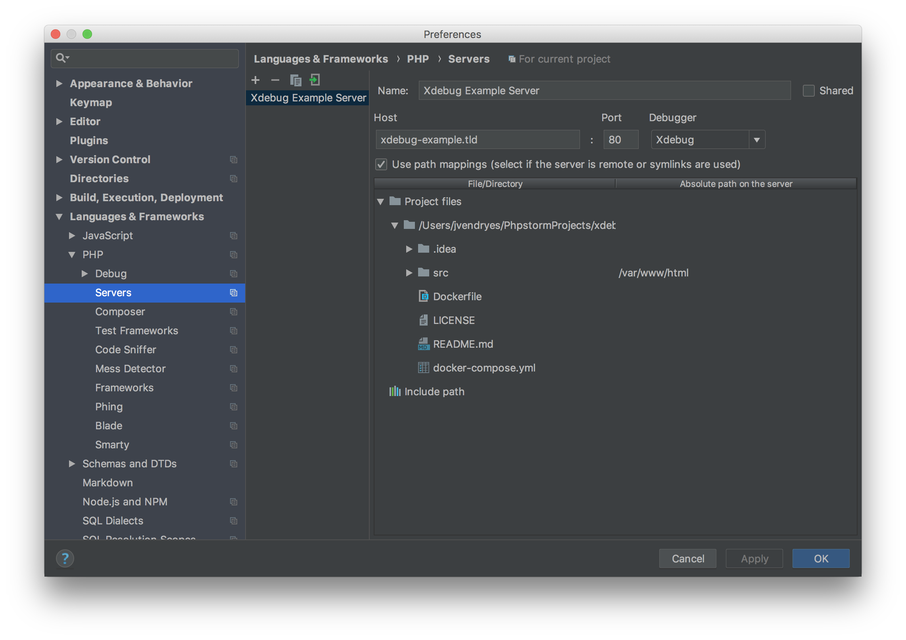

# xdebug-docker-example
An example app used to demonstrate a basic Xdebug configuration using Docker, specifically for remote debugging.

## Example app
As mentioned, this app is just an example of how to configure remote debugging with Xdebug and Docker.

### How to run the app
If you are using `docker-compose`, you simply need to run `docker-compose up -d`, otherwise, start the container using your preferred method.

## Container configuration
- Install Xdebug in your container
- Set Xdebug config options (https://xdebug.org/docs/all_settings)
    - I'm setting `xdebug.remote_port`, `xdebug.remote_enable`, and `xdebug.remote_connect_back` (see the `Dockerfile`)
- For my setup, I am using a Docker proxy called "[Fetch Proxy](https://github.com/kcmerrill/fetch-proxy)" which routes traffic based on container name, this is why I'm only exposing port 80 in my `docker-compose.yml` file
    - You will need to set the proper ports for your setup

## IDE configuration
### PhpStorm 2018
#### Configure your app server

- I've setup a fake app URL (xdebug-example.tld), set to the port my app runs on (80 in my case, defined in my `docker-compose.yml` file) and that it should expect Xdebug as the debugger
- Make sure you have a server defined (Languages & Frameworks > PHP > Servers) and that you've mapped the paths between your local files to your remote files

#### Set your Xdebug configurations

- The Debug config inside of PhpStorm's preferences (Languages & Frameworks > PHP > Debug) lists the "Pre-configuration" steps for Xdebug and Zend Debugger
    - Step 1 asks you to install Xdebug (as shown in the `Dockerfile` of this project)
    - Step 2 asks you to install a browser extension called "Xdebug helper"
    - Step 3 enables PhpStorm so that it's listening for debug connections (over the port specified under the Xdebug section)
    - Step 4 wants you to tell the browser extension to start debug mode
- I'm using the default port of 9000, I've also enabled a few settings as shown in the screenshot

#### Set your run/debug configurations 

- Under "Run/Debug Configuration", create a new PHP Remote Debug configuration
- Enable the "Filter debug connection by IDE key" option
- Select the server you created above and set the IDE key to `PHPSTORM`
- Notice the "Pre-configuration" steps listed

#### Configure/start Xdebug helper
- In your browser (Chrome in my case), right click on the Xdebug helper extension and click configure
    - Make sure you've selected PhpStorm as your IDE and your IDE key matches the one set previous (`PHPSTORM` in this case)
- Navigate to your app, left click on Xdebug helper and click "Debug" from the dropdown

#### Start debugging
- At this point everything should be configured
- Click the "Start Listening for for PHP Debug Connections", you should get a green light

- Add a breakpoint to your code in PHP and run your app

## Other IDEs
- Feel free to contribute!

## References
- https://www.jetbrains.com/help/phpstorm/2018.1/debug.html
- https://www.jetbrains.com/help/phpstorm/2018.1/debugging-with-phpstorm-ultimate-guide.html
- https://confluence.jetbrains.com/display/PhpStorm/Docker+Support+in+PhpStorm
- https://confluence.jetbrains.com/display/PhpStorm/Zero-configuration+Web+Application+Debugging+with+Xdebug+and+PhpStorm
- https://blog.philipphauer.de/debug-php-docker-container-idea-phpstorm/
- http://ramkulkarni.com/blog/setting-up-and-debugging-php7-in-docker/